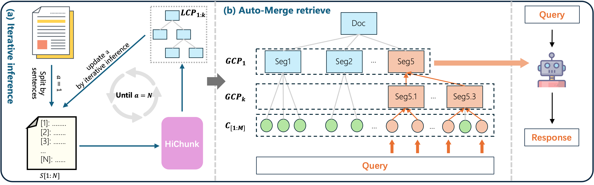

#  HiChunk: Evaluating and Enhancing Retrieval-Augmented Generation with Hierarchical Chunking

<div align="center"> 

[](https://arxiv.org/abs/2509.11552)
[](https://github.com/TencentYoutuResearch/HiChunk)
[]() 
[]() 
</div>

<div style="display: flex;">

[//]: # (<div style="width: 30%">)
[//]: # ()
[//]: # (</div>)

<div>


- `HiCBench` is a benchmark focused on evaluating document chunking quality. We select high-quality documents from [OHRBench](https://huggingface.co/datasets/opendatalab/OHR-Bench) to form the original corpus of HiCBench. HiCBench contains detailed hierarchical structural annotations of the documents, which are used to synthesize evidence-intensive QA pairs. Compared to other benchmarks used to evaluate RAG systems, HiCBench provides better assessment of different chunking methods, thereby helping researchers identify bottlenecks in RAG systems.
- `HiChunk` is a hierarchical document chunking framework for RAG systems. Combined with the Auto-Merge retrieval algorithm, it can dynamically adjust the semantic granularity of retrieval fragments, mitigating issues of incomplete information caused by chunking.
</div>
</div>


## Framework
<div align="center">

</div>

## Installation
```shell
git clone https://github.com/TencentYoutuResearch/HiChunk.git
cd HiChunk

conda create -n HiChunk python=3.10
conda activate HiChunk
pip install -r requirements.txt
python -c "import nltk; nltk.download('punkt_tab')"
```

### Project Structure
```text
HiChunk
├── config
├── corpus                      # Training data
├── dataset
│   ├── doc                     # Document data
│       └── {dataset}
│               └── {doc_id}.txt      # Document
│   └── qas                     # QA data
│       └── {dataset}.jsonl     # QA list
└── pipeline
    ├── chunking     # Chunking module
    ├── indexing     # Building index
    ├── embedding    # Calculate embedding vectors
    ├── retrieval    # Calculate similarity between query and chunks
    └── mBGE.sh      # Script to build testing data
```
### Train Data Processing
Download raw datasets from [qasper](https://huggingface.co/datasets/allenai/qasper), [gov-report](https://gov-report-data.github.io/), [wiki-727k](https://github.com/koomri/text-segmentation?tab=readme-ov-file) and extract files to the local path. Then change the `origin_data_path` in `process_train_data.ipynb` and run the preprocessing code.
```shell
origin_data_path = 'path/to/qasper'
origin_data_path = 'path/to/gov-report'
origin_data_path = 'path/to/wiki_727'
```
Then, run `build_train_data.py` to build training dataset. The data file will be saved in dir `corpus/combined`. 
These data files are used for training HiChunk model by [llama-factory](https://github.com/hiyouga/LLaMA-Factory) lab.
```shell
git clone --depth 1 https://github.com/hiyouga/LLaMA-Factory.git
cd LLaMA-Factory
pip install -e . --no-build-isolation
pip install deepspeed==0.16.9

export CUDA_VISIBLE_DEVICES=0,1,2,3,4,5,6,7
llamafactory-cli train ../HiChunk_train_config.yaml
```

### QA Data Format
Each data item in `HiChunk/dataset/qas/{dataset}.txt` are represented as following format:
```json
{
    "input": "str. Question",
    "answers": "list[str]. A List of all true answers",
    "facts": "list[str]. Facts mentioned in answers",
    "evidences": "list[str]. Sentences from original document related to question",
    "all_classes": "list[str]. Used to compute subset metric in eval.py",
    "_id": "str. {doc_id}"
}
```

## Getting Start
### 1. Document Chunking
Perform different document chunking methods by running the following scripts:
```shell
# run SemanticChunk
bash pipeline/chunking/SemanticChunk/semantic_chunking.sh

# run LumberChunk
export MODEL_TYPE="Deepseek"
export DS_BASE_URL="http://{ip}:{port}"
bash pipeline/chunking/LumberChunk/lumber_chunking.sh

# run HiChunk
export MODEL_PATH="path/to/HiChunk_model"
bash pipeline/chunking/HiChunk/hi_chunking.sh

# analyze chunking result
python pipeline/chunking/chunk_result_analysis.py
```
#### Custom Chunking Result
You can test the results of different chunking methods. Just save the chunking results in the following format to quickly validate performance. 
Each element in the `splits` field contains two sub-elements: `chunk` and `level`. `level` indicates the hierarchical level of the chunk's starting position. 
Concatenate `chunk 1:n` to form the original document.
```json
{
  "file_name": {
    "splits": [
      ["chunk 1", 1],
      ["chunk 2", 2],
      ["chunk 3", 2],
      ["chunk 4", 1],
      ["chunk n", 3]
    ]
  }
}
```

### 2. Build Dataset
Use the mBGE.sh script to construct the test dataset file `bash mBGE.sh {CHUNK_TYPE} {CHUNK_SIZE}`. For `SC`, `LC`, and `HC`, `CHUNK_SIZE` indicates the size for further rule-based chunking. Set `CHUNK_SIZE` to a larger value, such as 100000, to use only the results of chunking model without further rule-based chunking.
```shell
bash pipeline/mBGE.sh C 200        # fix chunking with 200 chunk size
bash pipeline/mBGE.sh SC 100000    # semantic chunking 
bash pipeline/mBGE.sh LC 100000    # lumber chunking 
bash pipeline/mBGE.sh HC 200       # hi_chunking with 200 fix chunking size 
```

### 3. Response Generation
```shell
vllm serve meta-llama/Llama-3.1-8B-Instruct --port 8000

python pred.py --model llama3.1-8b --data BgeM3/C200 --token_num 4096 --port 8000
python pred.py --model llama3.1-8b --data BgeM3/SC100000 --token_num 4096 --port 8000
python pred.py --model llama3.1-8b --data BgeM3/LC100000 --token_num 4096 --port 8000
python pred.py --model llama3.1-8b --data BgeM3/HC200_L10 --token_num 4096 --port 8000
python pred.py --model llama3.1-8b --data BgeM3/HC200_L10 --token_num 4096 --auto_merge 1  --port 8000
```

### 4. Evaluation
```shell
python eval.py --model llama3.1-8b --data BgeM3/C200_tk4096
python eval.py --model llama3.1-8b --data BgeM3/SC100000_tk4096
python eval.py --model llama3.1-8b --data BgeM3/LC100000_tk4096
python eval.py --model llama3.1-8b --data BgeM3/HC200_L10_tk4096
python eval.py --model llama3.1-8b --data BgeM3/HC200_L10_tk4096_AM1
```

## Acknowledgement
The project is based on the excellent work of several open source projects:
- [LongBench](https://github.com/THUDM/LongBench/tree/main)
- [GraphRAG-Benchmark](https://github.com/GraphRAG-Bench/GraphRAG-Benchmark/tree/main)
- [Contriever](https://github.com/facebookresearch/contriever)

## Citation
```
@misc{hi-chunk-2025,
  title={HiChunk: Evaluating and Enhancing Retrieval-Augmented Generation with Hierarchical Chunking},
  author={Tencent Youtu Lab},
  year={2025},
  publisher = {GitHub},
  journal = {GitHub repository},
  howpublished = {\url{https://github.com/TencentYoutuResearch/HiChunk.git}},
}
```